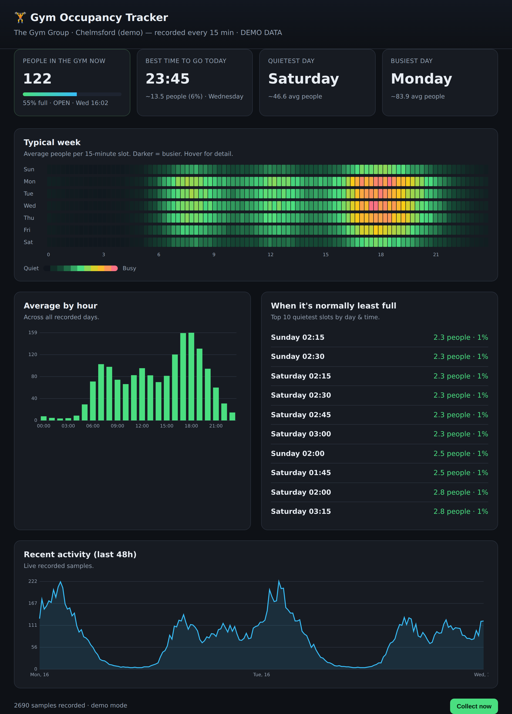

# AFT — Automatic Gym Occupancy Tracker

A small web app that records **how many people are in The Gym Group,
Chelmsford** every 15 minutes and turns that history into insights — most
usefully, **when the gym is normally least full**.

It reads live occupancy from The Gym Group's mobile API, stores each reading in
a local SQLite database, and serves a dashboard with the current headcount, a
typical-week heatmap, per-hour averages, and a ranked list of the quietest
times to go.



## Highlights

- **Records every 15 minutes** into SQLite, aligned to the wall-clock quarter
  hour, de-duplicated per time bucket.
- **Insights**
  - Best time to go **today** (from now onward, using this weekday's pattern).
  - Quietest / busiest **day of the week**.
  - Top 10 **quietest slots** (day + time).
  - **Typical-week heatmap** (7 days × 96 fifteen-minute slots).
  - Average **by hour** and a **live 48-hour** trend.
- **Zero runtime dependencies.** Uses only Node's built-ins — the HTTP server,
  `fetch`, and the built-in `node:sqlite`. No `npm install`, no native builds.
- **Demo mode.** With no credentials it generates realistic synthetic data so
  the whole app works immediately.

## Requirements

- **Node.js ≥ 22.5** (for the built-in `node:sqlite` module).

## Quick start (demo mode)

```bash
npm run seed:demo   # backfill ~4 weeks of realistic sample data
npm start           # dashboard on http://localhost:3000
```

Open http://localhost:3000. No account needed — it runs on synthetic data
clearly labelled "DEMO DATA".

## Live mode (real Chelmsford data)

Live occupancy comes from The Gym Group's app API, which requires a valid
membership login (any member's credentials work — the occupancy figure is the
same public "people in the gym now" number shown in the app).

```bash
cp .env.example .env
# edit .env:
#   GYM_GROUP_EMAIL=you@example.com
#   GYM_GROUP_PIN=your-8-digit-pin
#   GYM_NAME_QUERY=Chelmsford
npm start
```

On startup the app logs in, finds the gym whose name contains `GYM_NAME_QUERY`
("Chelmsford"), and begins recording a real sample every 15 minutes. Leave it
running to build up history; insights get richer over time.

> Tip: to skip the name lookup, set `GYM_LOCATION_ID` to the exact gym UUID.

## Configuration

All configuration is via environment variables (or a `.env` file):

| Variable                | Default              | Purpose                                              |
| ----------------------- | -------------------- | ---------------------------------------------------- |
| `GYM_GROUP_EMAIL`       | _(empty)_            | Gym Group login email. Empty ⇒ **demo mode**.        |
| `GYM_GROUP_PIN`         | _(empty)_            | Gym Group login PIN/password.                        |
| `GYM_NAME_QUERY`        | `Chelmsford`         | Gym to track (case-insensitive name match).          |
| `GYM_LOCATION_ID`       | _(empty)_            | Pin an exact gym UUID (skips name lookup).           |
| `POLL_INTERVAL_MINUTES` | `15`                 | How often to record a sample.                        |
| `PORT`                  | `3000`               | HTTP port.                                           |
| `DB_PATH`               | `./data/occupancy.db`| SQLite database file.                                |

## How it works

```
The Gym Group API ──► Collector (every 15 min) ──► SQLite ──► Insights ──► Dashboard
```

- `src/gymClient.js` — logs in (`POST exerciser/login`), resolves the gym
  (`GET company/children`), reads occupancy
  (`GET .../{uuid}/gym-busyness?gymLocationId=…`).
- `src/collector.js` — schedules collection, handles session refresh, writes
  samples (or synthetic ones in demo mode).
- `src/db.js` — `node:sqlite` schema + upsert-by-time-bucket.
- `src/insights.js` — aggregation queries (heatmap, quietest slots, day/hour
  rankings, best time today).
- `src/server.js` — dependency-free HTTP server exposing the JSON API and the
  static dashboard in `public/`.

### API endpoints

| Endpoint                    | Description                                   |
| --------------------------- | --------------------------------------------- |
| `GET /api/status`           | Current headcount + collection metadata.      |
| `GET /api/insights`         | Best time today, quietest/busiest, hourly.    |
| `GET /api/heatmap`          | 7 × 96 grid of average counts.                |
| `GET /api/recent?hours=48`  | Raw recent samples for the trend chart.       |
| `POST /api/collect`         | Take one reading immediately.                 |

## Running collection from cron

Instead of the built-in scheduler you can drive collection externally and only
run the server for viewing:

```cron
*/15 * * * *  cd /path/to/AFT && npm run collect:once
```

## Notes

- The database (`data/`) and `.env` are git-ignored.
- The Gym Group API is unofficial/reverse-engineered; endpoints may change.
  If a call fails, the dashboard keeps serving stored history and surfaces the
  error under the footer.
